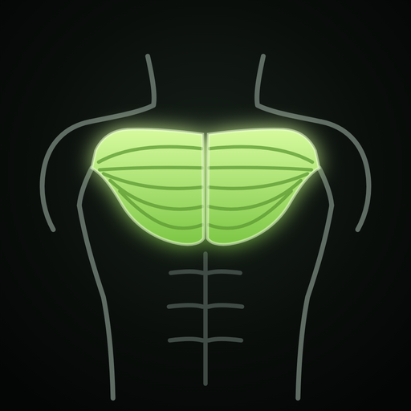

<p align="center">
  
</p>

<h1 align="center">Дневник формы</h1>

<p align="center">
  Калории, вода, зал и прогулки — в одном приложении на телефоне.<br>
  Без регистрации, без рекламы, данные хранятся только у тебя.
</p>

<p align="center">
  <a href="https://ca4ok2011.github.io/forma/"><b>Открыть приложение →</b></a>
</p>

---

## Что умеет

| Раздел | Возможности |
|---|---|
| **Сегодня** | Сводка дня: калории, вода, тренировка, прогулка, вес, достижения, итоги 7 дней |
| **Еда** | База из 320+ продуктов, порции поштучно (яйцо, банка энергетика 0,45 л, ломтик, ложка), напитки в мл, свои продукты, избранное, «как вчера», Б/Ж/У и памятка для новичков |
| **Вода** | Норма по весу, типы напитков, напитки из «Еды» засчитываются автоматически (кроме алкоголя) |
| **Зал** | 68 упражнений с фото и схемой мышц, подходы и вес, 1 или 2 гантели, кардио с отрезками (разный наклон/скорость), таймер отдыха, рекорды, прогресс силы и выносливости, карта мышц |
| **Прогулки** | Шаги → километры и калории по твоему росту, весу и полу, цель на день, календарь, прогресс по дням и неделям |
| **Вес** | Дневник веса, тренды за неделю и месяц, график |
| **Достижения** | 13 достижений × 3 уровня (бронза, серебро, золото) — считаются по дневнику |

Калории считаются честно: цель дня = обмен веществ (Миффлин — Сан Жеор) × активность + сожжённое в зале и на прогулках ± дефицит/профицит под цель.

## Установка на iPhone

1. Открой **[ca4ok2011.github.io/forma](https://ca4ok2011.github.io/forma/)** в **Safari**.
2. Нажми **«Поделиться»** → **«На экран «Домой»»**.
3. Запускай с иконки — приложение работает на весь экран и без интернета.

> Данные Safari-вкладки и приложения с экрана «Домой» хранятся раздельно. Пользуйся чем-то одним — лучше иконкой.

**Android:** открой ссылку в Chrome → меню ⋮ → **«Добавить на главный экран»**.

## Данные и приватность

- Всё хранится **только на устройстве** (localStorage + копия в IndexedDB). Никаких серверов и аккаунтов.
- **Обновление приложения не трогает данные** — меняются только файлы самого приложения.
- Перед первым запуском каждой новой версии приложение само делает внутренний снимок данных.
- Сделай **резервную копию**: «Настройки» → «Данные» → «Резервная копия». Восстановление — «Восстановить из копии» (существующие записи не затираются).
- Данные пропадут, только если удалить приложение с экрана «Домой», очистить данные Safari или сменить адрес сайта.

## Как обновить сайт (для владельца репозитория)

1. На GitHub открой репозиторий → **Add file** → **Upload files**.
2. Перетащи новые `index.html` и `sw.js` (и папку `icons/`, если менялась иконка) → **Commit changes**.
3. Через 1–2 минуты GitHub Pages опубликует изменения. На телефоне закрой и снова открой приложение — номер версии виден внизу настроек.

Первичная настройка Pages: **Settings → Pages → Deploy from a branch → `main` / `(root)`**.

## Структура

```
index.html             приложение целиком (HTML + CSS + JS в одном файле)
sw.js                  service worker: офлайн-режим и кэш файлов
manifest.webmanifest   название, цвета и иконки для установки
icons/                 иконки приложения (180, 192, 512, maskable)
fonts/                 шрифты Manrope и Unbounded (локально, без Google Fonts)
ex/                    фото упражнений (webp)
```

Сборки нет — это статичный сайт, его можно открыть с любого хостинга.

## Версии

`мажор.минор.патч` — например **2.10.1**:

- **патч** (2.10.**1**) — исправления багов;
- **минор** (2.**11**.0) — новые функции;
- **мажор** (**3**.0) — большие переделки.

## Благодарности и лицензии

- Фото упражнений — [Free Exercise DB](https://github.com/yuhonas/free-exercise-db) (общественное достояние, Unlicense).
- Схемы мышц — на основе «Muscular system» с [Wikimedia Commons](https://commons.wikimedia.org/) через проект [wger](https://github.com/wger-project/wger); лицензия — как у исходных файлов.
- Шрифты [Manrope](https://fonts.google.com/specimen/Manrope) и [Unbounded](https://fonts.google.com/specimen/Unbounded) — SIL Open Font License 1.1.
- Расход энергии: Compendium of Physical Activities, уравнения ACSM, формула Keytel (по пульсу), Concept2 (гребля).

---

<sub>Личный некоммерческий проект. Цифры калорий и БЖУ — ориентировочные и не заменяют консультацию врача или диетолога.</sub>
